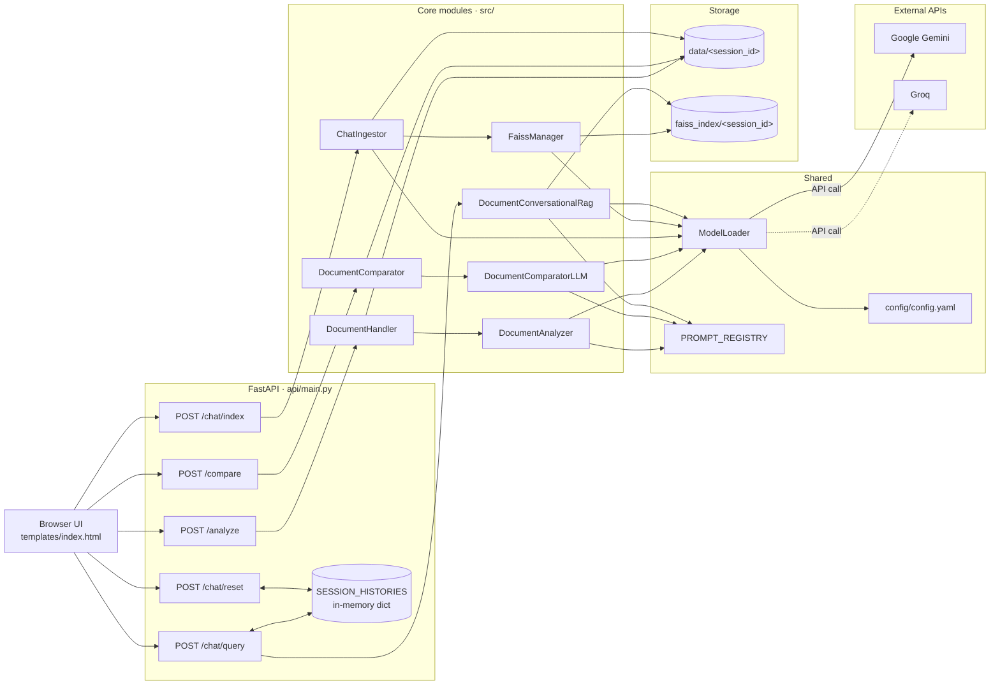

# Document Portal

   

A FastAPI-based document intelligence portal that turns PDFs (and a few other text formats) into something you can analyze, compare, and chat with. It ties together LangChain, FAISS, and Google Gemini / Groq behind a single browser UI so you can:

- **Analyze a document** — upload a PDF and get a structured summary and metadata via an LLM.
- **Compare two documents** — upload a reference PDF and an actual PDF, get a page-wise diff of what changed.
- **Chat with your documents** — upload one or more files (PDF / DOCX / TXT), build a session-scoped FAISS index, and ask follow-up questions. Chat history is kept per session, so the model remembers earlier turns just like a normal conversation.

Under the hood:

- **FastAPI** serves both the HTML UI and the JSON API.
- **LangChain LCEL** wires the retrieval, history-aware question rewriting, and answer generation steps.
- **FAISS** stores per-session vector indices on disk.
- **Google Gemini** is the default for embeddings and chat; **Groq** is available as an alternative LLM.
- **Pydantic** schemas drive structured outputs for analysis and comparison.

> _Add a screenshot of the UI here once available:_ ``

---

## Architecture



| Layer          | Tech                                 |
| -------------- | ------------------------------------ |
| API            | FastAPI, Uvicorn                     |
| Orchestration  | LangChain LCEL                       |
| LLM            | Google Gemini, Groq                  |
| Embeddings     | `models/gemini-embedding-001`        |
| Vector store   | FAISS (local, per-session folders)   |
| PDF parsing    | PyMuPDF (`fitz`)                     |
| Schemas        | Pydantic v2                          |
| UI             | Static HTML + vanilla JS (`fetch`)   |

---

## Getting started

**Prerequisites:** Python 3.10 or newer.

### 1. Activate your virtual environment

Create one if you don't already have it, then activate it. From the project root on Windows:

```powershell
python -m venv env
env\Scripts\activate
```

On macOS / Linux:

```bash
python -m venv env
source env/bin/activate
```

### 2. Install dependencies

```bash
pip install -r requirements.txt
pip install -e .
```

### 3. Provide API keys

Create a `.env` file in the project root:

```env
GOOGLE_API_KEY=your-google-genai-key
GROQ_API_KEY=your-groq-key
# Optional — "google" (default) or "groq"
LLM_Provider=google
```

### 4. Run the API

From the project root (not from inside `api/`):

```bash
uvicorn api.main:app --reload
```

Open `http://127.0.0.1:8000` in your browser to use the UI.

### 5. (Optional) Run the standalone tests

Quick sanity scripts at the project root exercise each pipeline without the API:

```bash
python data_analyzer_test.py
python data_compare_test.py
python single_docchat_test.py
python multi_doc_chat_test.py
```

---

## API endpoints

| Method | Path           | Purpose                                              |
| ------ | -------------- | ---------------------------------------------------- |
| GET    | `/`            | Serves the HTML UI                                   |
| GET    | `/health`      | Liveness check                                       |
| POST   | `/analyze`     | Single PDF → structured analysis                     |
| POST   | `/compare`     | Reference PDF + actual PDF → page-wise diff          |
| POST   | `/chat/index`  | Upload files and build a FAISS index for a session   |
| POST   | `/chat/query`  | Ask a question against a session's index (w/ memory) |
| POST   | `/chat/reset`  | Clear the in-memory chat history for a session       |

### Example: build an index then chat against it

```bash
# 1. Build a session index from one or more files
curl -X POST http://127.0.0.1:8000/chat/index \
  -F "files=@./mydoc.pdf" \
  -F "chunk_size=1000" \
  -F "chunk_overlap=200" \
  -F "k=5"
# -> {"session_id":"session_2026_05_11_...", "k":5, ...}

# 2. Ask a question against that session (memory enabled)
curl -X POST http://127.0.0.1:8000/chat/query \
  -F "question=What is this paper about?" \
  -F "session_id=session_2026_05_11_..."

# 3. Follow-up — "it" resolves because history is preserved server-side
curl -X POST http://127.0.0.1:8000/chat/query \
  -F "question=How many encoder layers does it use?" \
  -F "session_id=session_2026_05_11_..."

# 4. Wipe the conversation but keep the index
curl -X POST http://127.0.0.1:8000/chat/reset \
  -F "session_id=session_2026_05_11_..."
```

---

## Folder structure

```
mine one/
├── api/                    # FastAPI app
│   └── main.py             # Routes, app config, session history
├── config/
│   └── config.yaml         # Model / retriever / embedding config
├── exception/
│   └── custom_exception.py # DocumentPortalCustomException
├── logger/
│   └── custom_logger.py    # JSON-structured logger
├── model/
│   └── models.py           # Pydantic schemas + PromptTypes enum
├── prompt/
│   └── prompt_library.py   # PROMPT_REGISTRY (LangChain prompts)
├── src/
│   ├── data_ingestion/
│   │   └── data_ingestion.py    # DocumentHandler, DocumentComparator,
│   │                            #   ChatIngestor, FaissManager
│   ├── document_analyzer/
│   │   └── data_analysis.py     # DocumentAnalyzer (single-doc LLM)
│   ├── document_compare/
│   │   ├── data_ingestion.py    # PDF read / save helpers
│   │   └── document_comparator.py  # DocumentComparatorLLM
│   └── document_chat/
│       └── retrieval.py         # DocumentConversationalRag (LCEL chain)
├── static/                 # JS / CSS / icons served at /static
├── templates/
│   └── index.html          # Browser UI (3 tabs)
├── utils/
│   ├── config_loader.py
│   ├── document_ops.py
│   ├── file_io.py
│   └── model_loader.py     # Loads LLM + embedding models
├── test/                   # Unit tests
├── requirements.txt
├── setup.py
├── version.py
└── README.md
```

> The following are produced at runtime or are environment-specific and are intentionally git-ignored, so they are not described above: `env/`, `.env`, `document_portal.egg-info/`, `notebook/`, `logs/`, `__pycache__/`, `data/`, `faiss_index/`, `archive/`. They appear on first run.

---

## How chat memory works (short version)

1. `POST /chat/index` builds a FAISS index at `faiss_index/<session_id>/`.
2. `POST /chat/query` looks up `SESSION_HISTORIES[session_id]` (an in-memory dict of `BaseMessage` lists) and feeds it into the LCEL chain. The chain's first step rewrites the user question with the conversation history, then retrieves top-K chunks and generates an answer. The new user/assistant turn is appended back to the dict.
3. `POST /chat/reset` clears the history for that session (the FAISS index is untouched).

History is in-process only — it resets when the server restarts. For persistence, swap the dict for Redis / SQLite.

---

## Known limitations

- **No authentication** — the API is wide open. Do not expose it on a public host as-is.
- **Chat history is in-process only** — cleared on restart, and won't work correctly behind multiple uvicorn workers. Move it to Redis / SQLite for production.
- **Encrypted PDFs are rejected** — the loader explicitly raises on `is_encrypted` documents.
- **File-type support is asymmetric** — `/analyze` and `/compare` accept only PDFs; `/chat/index` accepts `.pdf`, `.docx`, `.txt`.
- **History has no turn cap** — long conversations may eventually exceed the LLM's context window.
- **Single-machine FAISS** — indices live on local disk under `faiss_index/<session_id>/`; not shared between hosts.

## Roadmap

- Persist chat history (Redis or SQLite).
- Stream `/chat/query` responses with Server-Sent Events.
- Return source citations alongside chat answers.
- Add basic auth / API-key middleware.

---

## Developed by

**Rashedul Haque**
