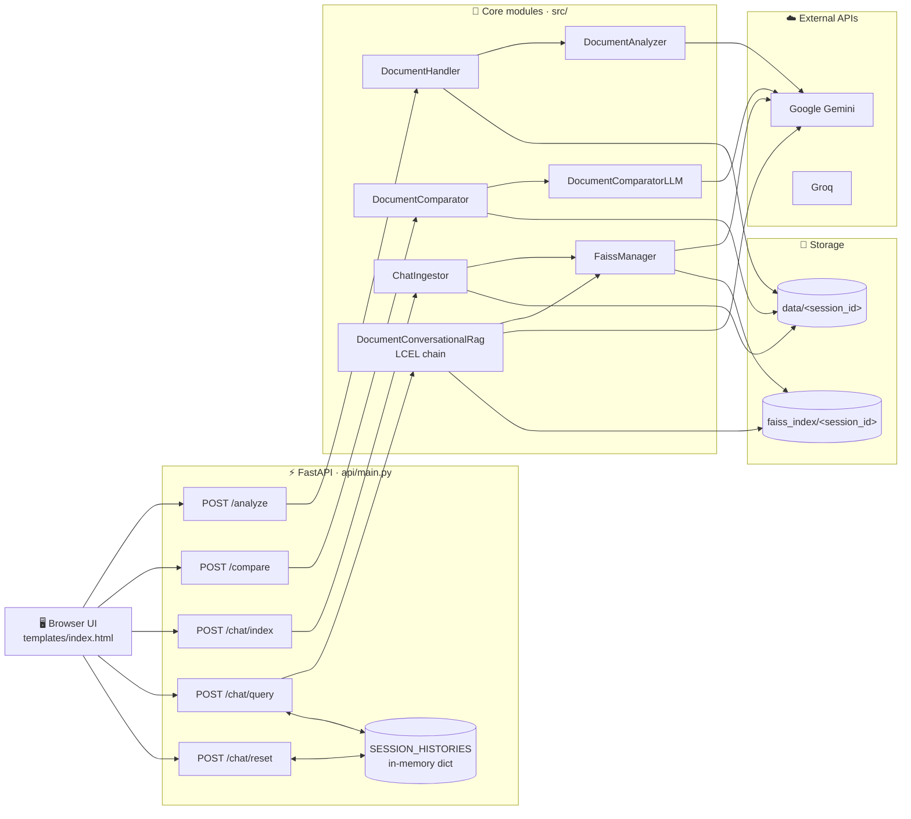
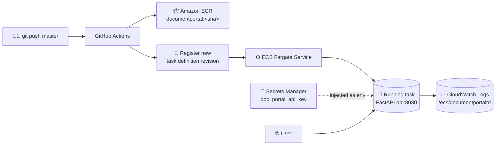

# 📄 Document Portal

[](https://www.python.org)
[](https://fastapi.tiangolo.com)
[](https://www.langchain.com)
[](https://github.com/facebookresearch/faiss)
[](https://www.docker.com)
[](https://aws.amazon.com)
[](https://github.com/features/actions)

> **A document intelligence portal that lets you analyze, compare, and chat with PDF/DOCX/TXT files — running locally in Docker or auto-deployed to AWS ECS Fargate on every push.**

---

## ✨ What it does

| Tab | Capability |
|---|---|
| **📊 Analyze** | Upload a PDF → get a structured summary, metadata, sentiment, page count, and key insights (Pydantic-validated). |
| **🆚 Compare** | Upload two PDFs (reference vs actual) → page-wise diff returned as a clean table. |
| **💬 Chat** | Upload one or more docs → build a session-scoped FAISS index → ask follow-up questions. **Chat history is preserved per session**, so the model resolves pronouns and references like a normal conversation. |

---

## 🏛️ Architecture



| Layer | Tech |
|---|---|
| **API** | FastAPI · Uvicorn |
| **Orchestration** | LangChain LCEL (history-aware retrieval) |
| **LLM** | Google Gemini · Groq (pluggable) |
| **Embeddings** | `models/gemini-embedding-001` |
| **Vector store** | FAISS (per-session folders) |
| **PDF parsing** | PyMuPDF (`fitz`) |
| **Schemas** | Pydantic v2 |
| **UI** | Static HTML + vanilla JS (`fetch`) |
| **Containerization** | Docker · Python 3.10-slim |
| **Cloud** | AWS ECS Fargate · ECR · Secrets Manager · CloudWatch Logs |
| **CI/CD** | GitHub Actions |

---

## 🚀 Quickstart (local)

**Prerequisites:** Python 3.10+

### 1. Clone and enter the project

```bash
git clone https://github.com/Rabby3075/document_portal.git
cd document_portal
```

### 2. Create and activate a virtual environment

**Windows (PowerShell):**
```powershell
python -m venv env
env\Scripts\activate
```

**macOS / Linux:**
```bash
python -m venv env
source env/bin/activate
```

### 3. Install dependencies

```bash
pip install -r requirements.txt
pip install -e .
```

### 4. Configure API keys

Create a `.env` file in the project root (no quotes, no spaces around `=`):

```env
GOOGLE_API_KEY=your-google-genai-key
GROQ_API_KEY=your-groq-key
# Optional — "google" (default) or "groq"
LLM_Provider=google
```

### 5. Run

```bash
uvicorn api.main:app --reload
```

Open **http://127.0.0.1:8000** in your browser.

---

## 🐳 Run with Docker

```bash
docker build -t document-portal .
docker run --rm -p 8080:8080 --env-file .env document-portal
```

Open **http://localhost:8080**.

> The `--env-file .env` flag injects your API keys without baking them into the image. `.env` is `.dockerignore`d, so secrets never end up in the build.

---

## ☁️ Deploy to AWS (production)

This repo is wired to **auto-deploy to AWS ECS Fargate on every push to `master`**. The pipeline is `.github/workflows/aws.yaml`.

### Deployment topology



### Pipeline stages

1. **Build & Push** — builds the Docker image and pushes to ECR tagged with the commit SHA.
2. **Deploy** — renders `task_definition.json` with the new image URI, registers a new revision, and updates the ECS service. ECS performs a rolling deployment.

### Required AWS setup (one-time)

| Resource | Purpose |
|---|---|
| **ECR repo** `documentportal` | image registry |
| **ECS cluster** `documentportal-cluster` | logical grouping |
| **ECS service** in that cluster | runs N copies of the task |
| **CloudWatch log group** `/ecs/documentportaltd` | container logs |
| **IAM role** `ecsTaskExecutionRole` | trust: `ecs-tasks.amazonaws.com`; policies: `AmazonECSTaskExecutionRolePolicy` + inline `secretsmanager:GetSecretValue` on your secret + `logs:CreateLogGroup` on `/ecs/*` |
| **Secrets Manager** secret with JSON value `{"GOOGLE_API_KEY":"...","GROQ_API_KEY":"..."}` | API keys |
| **Security group** allowing inbound TCP `8080` from `0.0.0.0/0` (or your IP) | external access |
| **GitHub repo secrets** `AWS_ACCESS_KEY_ID`, `AWS_SECRET_ACCESS_KEY` | CI credentials (or switch to OIDC) |

> See [Lessons learned](#-lessons-learned) below for the specific gotchas at each step.

---

## 📡 API reference

| Method | Path | Purpose |
|---|---|---|
| `GET`  | `/` | HTML UI |
| `GET`  | `/health` | Liveness check |
| `POST` | `/analyze` | Single PDF → structured analysis |
| `POST` | `/compare` | Reference + actual PDF → page-wise diff |
| `POST` | `/chat/index` | Upload files → build per-session FAISS index |
| `POST` | `/chat/query` | Ask a question against a session (with memory) |
| `POST` | `/chat/reset` | Clear in-memory chat history for a session |

### Example: build an index, then chat

```bash
# 1. Build a session index
curl -X POST http://127.0.0.1:8000/chat/index \
  -F "files=@./mydoc.pdf" \
  -F "chunk_size=1000" -F "chunk_overlap=200" -F "k=5"
# → {"session_id": "session_2026_05_11_...", ...}

# 2. First question
curl -X POST http://127.0.0.1:8000/chat/query \
  -F "question=What is this paper about?" \
  -F "session_id=session_2026_05_11_..."

# 3. Follow-up — "it" is resolved from history
curl -X POST http://127.0.0.1:8000/chat/query \
  -F "question=How many encoder layers does it use?" \
  -F "session_id=session_2026_05_11_..."

# 4. Wipe the conversation (FAISS index untouched)
curl -X POST http://127.0.0.1:8000/chat/reset \
  -F "session_id=session_2026_05_11_..."
```

---

## 🧠 How chat memory works

1. `POST /chat/index` builds a FAISS index at `faiss_index/<session_id>/`.
2. `POST /chat/query` looks up `SESSION_HISTORIES[session_id]` (an in-memory `dict[str, list[BaseMessage]]`), feeds it into the LCEL chain. The first chain step rewrites the user's question using history (`"how many layers does it use?"` → `"how many encoder layers does the Transformer use?"`). Top-K chunks are retrieved, the answer is generated, and the new user/AI turn is appended back to the dict.
3. `POST /chat/reset` clears history for that session.

History is in-process only — cleared on restart. For multi-worker or persistent setups, swap the dict for Redis / SQLite.

---

## 📁 Folder structure

```
document_portal/
├── api/                          # FastAPI app
│   └── main.py                   # Routes, app config, SESSION_HISTORIES
├── config/
│   └── config.yaml               # Model / retriever / embedding config
├── exception/
│   └── custom_exception.py       # DocumentPortalCustomException
├── logger/
│   └── custom_logger.py          # JSON-structured logger (structlog)
├── model/
│   └── models.py                 # Pydantic schemas + PromptTypes enum
├── prompt/
│   └── prompt_library.py         # PROMPT_REGISTRY (LangChain prompts)
├── src/
│   ├── data_ingestion/
│   │   └── data_ingestion.py     # DocumentHandler, DocumentComparator,
│   │                             #   ChatIngestor, FaissManager
│   ├── document_analyzer/
│   │   └── data_analysis.py      # DocumentAnalyzer
│   ├── document_compare/
│   │   ├── data_ingestion.py
│   │   └── document_comparator.py
│   └── document_chat/
│       └── retrieval.py          # DocumentConversationalRag (LCEL)
├── static/                       # CSS / icons served at /static
├── templates/
│   └── index.html                # Browser UI (3 tabs)
├── utils/
│   ├── config_loader.py
│   ├── document_ops.py
│   ├── file_io.py
│   └── model_loader.py           # Loads LLM + embedding models
├── test/                         # Unit tests
├── .github/workflows/
│   ├── aws.yaml                  # CI/CD: ECR build + ECS deploy
│   ├── ci.yaml                   # PR test runner
│   └── task_definition.json      # ECS Fargate task spec
├── Dockerfile
├── .dockerignore
├── requirements.txt
├── setup.py
├── version.py
└── README.md
```

> Git-ignored runtime artifacts (created on first run): `env/`, `.env`, `data/`, `faiss_index/`, `logs/`, `__pycache__/`, `document_portal.egg-info/`, `archive/`, `notebook/`.

---

## ⚙️ Environment variables

| Variable | Required | Used by | Description |
|---|---|---|---|
| `GOOGLE_API_KEY` | ✅ | local + Docker + ECS | Google Generative AI API key |
| `GROQ_API_KEY` | ✅ | local + Docker + ECS | Groq API key |
| `LLM_Provider` | ❌ | `ModelLoader` | `"google"` (default) or `"groq"` |
| `data_storage_path` | ❌ | `DocumentHandler` | Override default `data/document_analysis/` |
| `UPLOAD_BASE` | ❌ | API | Base path for ingest uploads (default `data/`) |
| `faiss_index` | ❌ | API | Base path for FAISS indices (default `faiss_index/`) |

In AWS, the two API keys are injected from **Secrets Manager** via the task definition — they are *not* baked into the Docker image.

---

## 🚧 Known limitations

- **No authentication.** API is wide open. Restrict via security group / API gateway / auth layer before exposing on a real domain.
- **Chat history is in-process.** Cleared on restart; doesn't sync across uvicorn workers. Use Redis / SQLite for persistence.
- **Public IP changes on every redeploy.** Fargate without an ALB hands out a new IP each task launch. Put an ALB in front for a stable URL.
- **Encrypted PDFs are rejected** by design.
- **History has no turn cap** — long sessions can eventually overrun the LLM context window. Trim to last N turns if needed.
- **Single-machine FAISS** — indices are local; not shared across tasks. For multi-replica deployments, use a managed vector DB (Pinecone, Weaviate, OpenSearch).

---

## 🗺️ Roadmap

- [ ] Put an Application Load Balancer in front for a stable URL
- [ ] Persist chat history in Redis / SQLite
- [ ] Stream `/chat/query` responses via Server-Sent Events
- [ ] Return source citations alongside chat answers
- [ ] Basic auth / API-key middleware
- [ ] Switch GitHub Actions to OIDC (drop long-lived AWS access keys)

---


Real production gotchas hit while shipping this to AWS Fargate — kept here for posterity (and recruiters).

| Step | What broke | Why | Fix |
|---|---|---|---|
| First deploy | `service is MISSING` | `amazon-ecs-deploy-task-definition` only **updates** services, doesn't create them | Created the ECS service manually before the first pipeline run |
| Task launch | `unable to assume role 'ecsTaskExecutionRole'` | Role didn't exist; AWS doesn't auto-create it outside the ECS wizard | Created it via IAM with trust principal `ecs-tasks.amazonaws.com` |
| Secret pull | `unexpected ARN format with parameters` | JSON-key references in `task_definition.json` need a trailing `::` | `arn:...:secret:name:JSON_KEY::` (note the two trailing colons) |
| Secret read | `AccessDeniedException on GetSecretValue` | Default `AmazonECSTaskExecutionRolePolicy` does NOT include Secrets Manager access | Added inline policy scoped to the secret ARN |
| Logging | `not authorized to perform logs:CreateLogGroup` | Default policy grants stream/put but not group creation | Pre-created `/ecs/documentportaltd` in CloudWatch (or grant the role) |
| Browser access | `ERR_CONNECTION_TIMED_OUT` | Security group blocked inbound 8080 | Added Custom TCP / 8080 / `0.0.0.0/0` inbound rule |
| Docker run | `400 API key not valid` | `.env` had quoted values; `docker --env-file` doesn't strip quotes | Removed `""` from `.env` |
| Local dev | `'NoneType' has no attribute 'tb_frame'` | Custom exception called `sys.exc_info()` outside an `except` block | Made the exception fall back to caller frame when no active exception |

---

## 🤝 Contributing

Contributions of any size are welcome — bug fixes, new features, docs, tests, or even just a thoughtful issue write-up.

### Good first issues

If you're new to the project, the easiest entry points are:

- **Roadmap items** (see the checklist above) — most can be tackled independently.
- **`# TODO` / `# FIXME` comments** in the source — `grep -rn "TODO\|FIXME" src/ api/ utils/`.
- **Docs** — typos, missing docstrings, better curl examples, or screenshots for the README.
- **Tests** — the `test/` folder is sparse; any new `pytest` coverage is a win.
- **The known limitations** section is essentially a feature backlog. Pick one.

If you're unsure whether something is worth doing, **open an issue first** describing what you want to change and why. It saves rework.

### Development setup

```bash
# 1. Fork the repo on GitHub, then clone your fork
git clone https://github.com/<your-username>/document_portal.git
cd document_portal

# 2. Create a feature branch off master
git checkout -b feat/short-description

# 3. Set up the venv and install in editable mode
python -m venv env
# Windows: env\Scripts\activate
source env/bin/activate
pip install -r requirements.txt
pip install -e .

# 4. Add your .env with API keys (see Environment variables above)

# 5. Run the app locally to verify nothing is broken
uvicorn api.main:app --reload
```

### Branching and commits

- Branch off `master`. Use a prefix: `feat/`, `fix/`, `docs/`, `refactor/`, `test/`, `chore/`.
- One logical change per PR. Don't bundle unrelated edits.
- Write commit messages in the imperative present tense: `add citations to chat answers`, not `added citations`.
- If your PR closes an issue, mention `Closes #123` in the description so GitHub links them.

### Code style

- **Python**: PEP 8 with reasonable line length (~100 chars). The codebase isn't dogmatic about formatters, but if you use `black` or `ruff format` keep it scoped to files you touched — don't reformat the entire repo in a feature PR.
- **Type hints** are encouraged on public functions, especially anything exported from `src/`.
- **Logging**: use the project's `CustomLogger` (`logger.custom_logger`) — never `print`.
- **Errors**: raise `DocumentPortalCustomException(message, sys)` from inside `except` blocks. The second argument must be the `sys` module, not the exception instance.
- **Prompts**: add new LangChain prompts to `prompt/prompt_library.py` and register them in `PROMPT_REGISTRY` with a corresponding entry in `model.models.PromptTypes`.

### Testing

If you add or change behavior, please add a test. Tests live in `test/` and run with:

```bash
pytest
```

The standalone smoke scripts at the project root (`data_analyzer_test.py`, `data_compare_test.py`, `single_docchat_test.py`, `multi_doc_chat_test.py`) also exercise the full pipelines end-to-end — useful for manual verification of larger changes.

> Note: tests that hit Gemini or Groq will require API keys. If you're contributing a feature that doesn't need the LLM, prefer mocking it so others can run your tests without credentials.

### Submitting a pull request

1. Push your branch to your fork.
2. Open a PR against `master` of the upstream repo.
3. PR description should cover:
   - **What** changed (one or two sentences).
   - **Why** — the motivation or the issue it fixes.
   - **How to verify** — concrete steps a reviewer can run.
   - **Screenshots** if it's a UI change.
4. The CI workflow (`.github/workflows/ci.yaml`) will run automatically. Make sure it stays green.
5. Be patient — reviews may take a few days. Feel free to ping after a week of silence.

### What doesn't get merged

Just so nobody wastes time:

- **Whole-codebase reformats** without discussion.
- **Dependency upgrades** without a clear reason (security fix, bug fix, or new feature need).
- **Style changes that contradict the patterns already in the codebase** — open an issue to discuss first.
- **Anything that bakes secrets into the image**, removes the `.dockerignore` protection on `.env`, or weakens the IAM scope in the AWS deployment.

### Reporting bugs

Open an issue with:

- What you did (steps to reproduce).
- What you expected.
- What actually happened (full traceback or screenshot if applicable).
- Your environment: OS, Python version, whether running locally / Docker / AWS.

### Asking questions

For general "how do I…" questions, open a **Discussion** rather than an Issue. Issues should be for bugs and concrete feature requests.

### Code of Conduct

Be respectful. Assume good intent. Critique code, not people. No spam, no harassment. Maintainers reserve the right to close issues / reject contributions that don't follow this norm.

---

## 👤 Developed by

**Rashedul Haque**

🔗 [LinkedIn](https://www.linkedin.com/in/rashedul-haque-6a1897194/) · 📧 rashed.rabby43@gmail.com

> Built solo end-to-end — RAG pipeline, FastAPI service, Docker image, ECS Fargate deployment, and CI/CD. Pull requests and feedback welcome.
